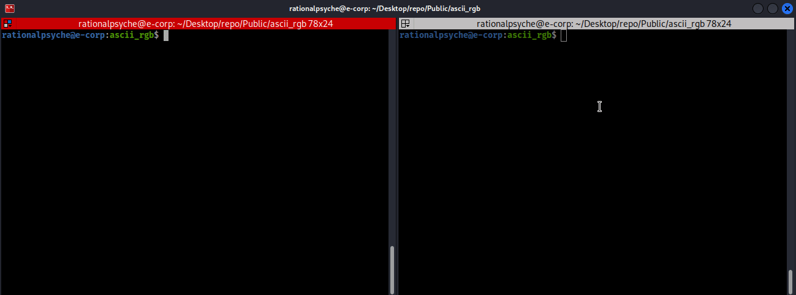
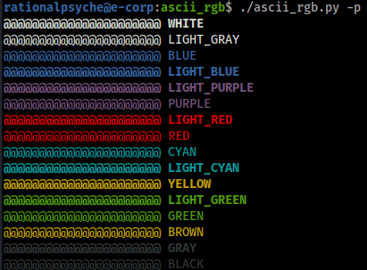

ascii_rgb - color ascii art with vim

# How to use

Open your ascii art and load the vim module (`:source ascii_rgb.vim`). Select in visual mode the line to color, then hit leader key and `yel` to colore it of yellow, leader and `red` to colore it of red etc. (a set of predefined mappings are defined in the module and can be customized).

A bash file with the colored ascii art is created, you can then place it for instance in `/etc/motd` to have a cool ssh login prompt.

The python script has a `--palette` option to display the available colors.

# How it works

The vim module saves the coordinates of the visual block, along with the chosen color to a file processed by the python script which creates a matrix for the entire text file, associating each character with the chosen color. The colored text is then rendered with escape characters as a bash file.
